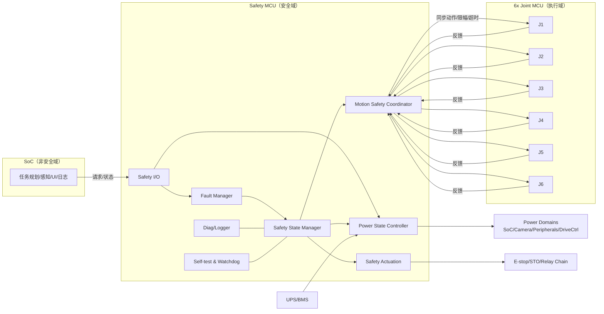
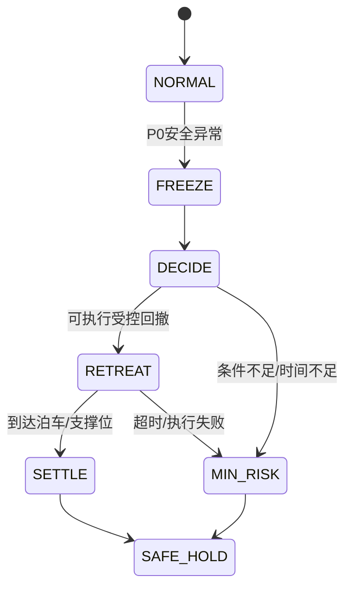
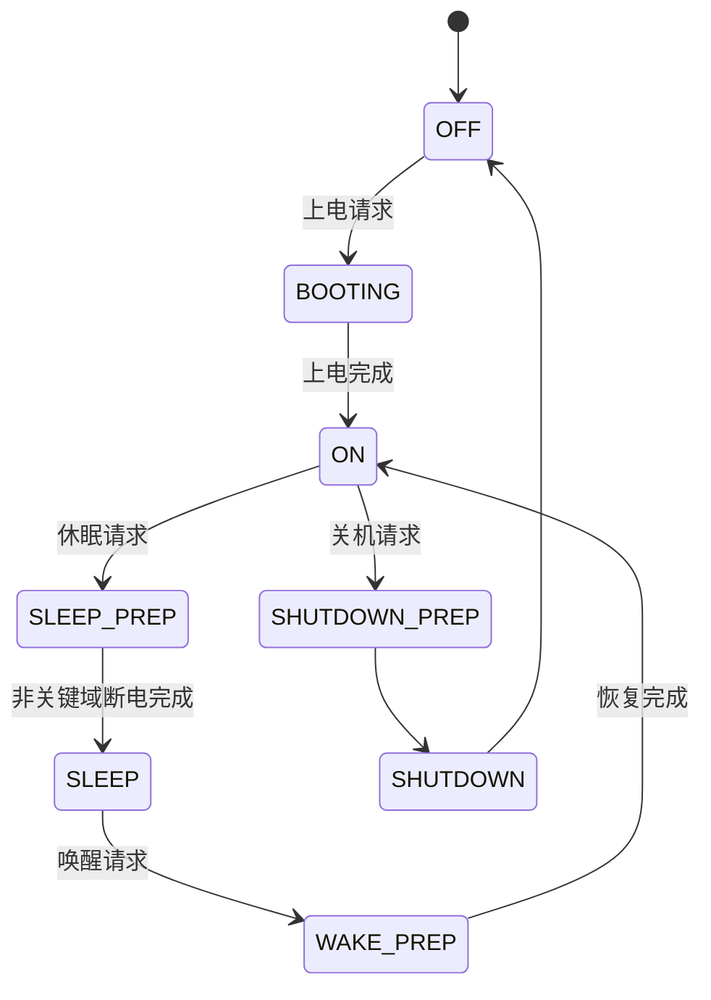

# Safety MCU 架构文档（结构化基线）

> 适用场景：6 关节独立关节 MCU + SoC（非安全域）+ UPS（约 20 秒运动窗口）

## 1. 文档目的与边界

本文档用于统一以下设计边界：

1. **电源控制（Power Control）** 与 **安全控制（Safety Control）** 的职责分离。
2. 在 SoC 离线/休眠/崩溃时，系统如何仍可独立进入可接受安全状态。
3. 在 UPS 仅支持短时运动窗口（约 20 秒）下，故障态如何收敛。

---

## 2. 总体架构（模块视图）

---

## 3. 职责分层（核心）

### 3.1 安全控制（Safety）负责什么

- 危险判定（安全输入、关键硬件异常、心跳失联）。
- 触发 `FREEZE -> DECIDE -> RETREAT -> SETTLE` 或 `MIN_RISK`。
- 必要时执行急停链路/STO/断使能等安全动作。

### 3.2 电源控制（Power）负责什么

- 上下电时序、休眠/唤醒、UPS 联动、负载降级。
- 控制 SoC/摄像头/外设等电源域。
- 为保臂链路提供优先供电（Safety MCU + Joint MCU + 驱动控制）。

### 3.3 关键原则

1. **安全状态机优先于电源状态机**（可抢占）。
2. SoC 只能“请求”，不能覆盖 Safety MCU 最终裁决。
3. 急停/切使能路径不依赖 SoC/普通通信。

---

## 4. 双状态机模型（必须并行建模）

## 4.1 Safety 状态机

## 4.2 Power 状态机

## 4.3 两者关系（抢占规则）

- 任意 Power 状态下出现 P0/P1 事件：`Safety -> FREEZE` 立即生效。
- 当 Safety != NORMAL 时：Power 只允许执行“安全允许的最小动作”（降载/保供电/受控断电）。
- 不允许为了完成休眠或关机步骤而延迟安全动作。

---

## 5. 事件优先级与处理策略

| 优先级 | 事件类型 | 典型事件 | 处理策略 |
|---|---|---|---|
| P0 | 安全异常 | 急停、安全回路断开、关键驱动故障 | 立即 `FREEZE`，抢占所有电源流程 |
| P1 | 电源保护 | UPS 低电量、关键供电异常 | 进入 `DECIDE` 并触发受控回撤或 `MIN_RISK` |
| P2 | 普通电源事件 | 休眠请求、普通唤醒、外设上/下电 | 仅在无 P0/P1 时执行 |

---

## 6. 休眠/唤醒策略（已对齐你的场景）

### 6.1 休眠时可断/不可断

- 可断：摄像头、非关键外设、非安全计算负载。
- 不可断：Safety MCU、Joint MCU、驱动控制电源、关键安全输入链路。

### 6.2 休眠期间异常处理

休眠期间若出现安全相关异常，必须执行：

`FREEZE -> DECIDE -> RETREAT -> SETTLE`（或 `MIN_RISK`）

而不是继续停留在 `SLEEP`。

---

## 7. 协调器与关节 MCU 接口（故障态最小集）

### 7.1 下行命令（Safety MCU -> Joint MCU）

| 字段 | 类型 | 说明 |
|---|---|---|
| `cmd_id` | u16 | 命令序号（单调递增） |
| `mode` | enum | `HOLD` / `RETREAT_A` / `RETREAT_B` / `MIN_RISK` |
| `q_target` | float | 目标角（阶段目标） |
| `dq_limit` | float | 本阶段速度上限 |
| `tau_limit` | float | 本阶段力矩/电流上限 |
| `t_deadline_ms` | u16 | 本阶段超时 |
| `sync_t0_ms` | u32 | 同步启动时间戳 |
| `power_mode` | enum | `ON/SLEEP_PREP/SLEEP/WAKE_PREP/SHUTDOWN_PREP` |
| `safety_override` | bool | `1` 表示安全抢占生效 |

### 7.2 上行反馈（Joint MCU -> Safety MCU）

| 字段 | 类型 | 说明 |
|---|---|---|
| `joint_id` | u8 | 关节号 1~6 |
| `cmd_id_ack` | u16 | 对应命令序号 |
| `q_actual` | float | 当前角度 |
| `dq_actual` | float | 当前速度 |
| `tracking_err` | float | 跟踪误差 |
| `fault_bits` | bitmask | 驱动/编码器/过流/过温等 |
| `state` | enum | `IDLE/RUNNING/DONE/FAILED` |

---

## 8. 时序与阈值建议（UPS 20 秒约束）

- SoC 心跳周期：10 ms。
- SoC 心跳超时判定：100~300 ms。
- 异常触发到 `FREEZE`：<= 100 ms。
- `DECIDE` 完成：<= 1 s。
- `RETREAT` 目标完成：建议 <= 12 s（保留余量）。
- 任一关节 `FAILED` 或阶段超时：立即切 `MIN_RISK`。

---

## 9. 运行期最小安全规则

1. 单轴硬限位/软限位/速度与电流限幅始终生效。
2. 故障态执行白名单动作，禁止 SoC 下发普通任务。
3. 命中关节组合禁区时，协调器必须减速或回退。
4. 超过阶段 deadline 未完成，必须升级到更保守动作。

---

## 10. MVP 落地清单

1. 2~3 条白名单回撤轨迹（按工作区分区）。
2. 10~20 条关节组合禁区规则。
3. 统一超时策略（心跳/轨迹/UPS 阈值）。
4. 统一故障码字典与事件日志字段。
5. P0/P1/P2 事件优先级在固件中可追溯验证。
