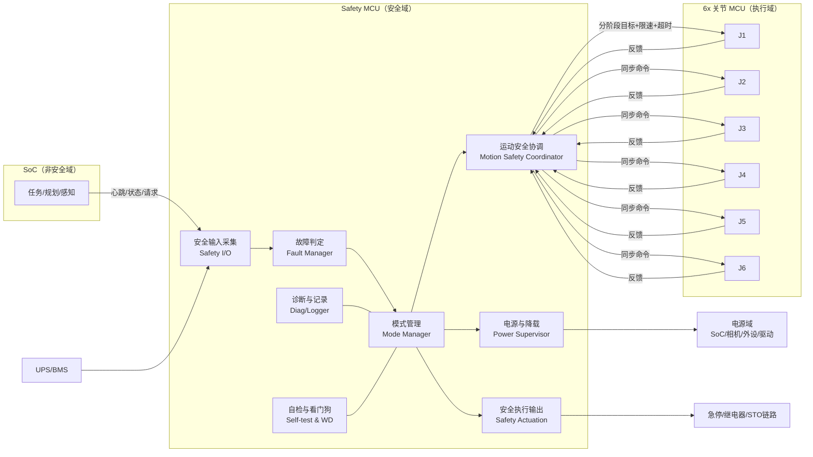
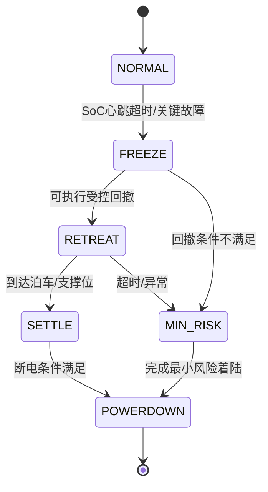
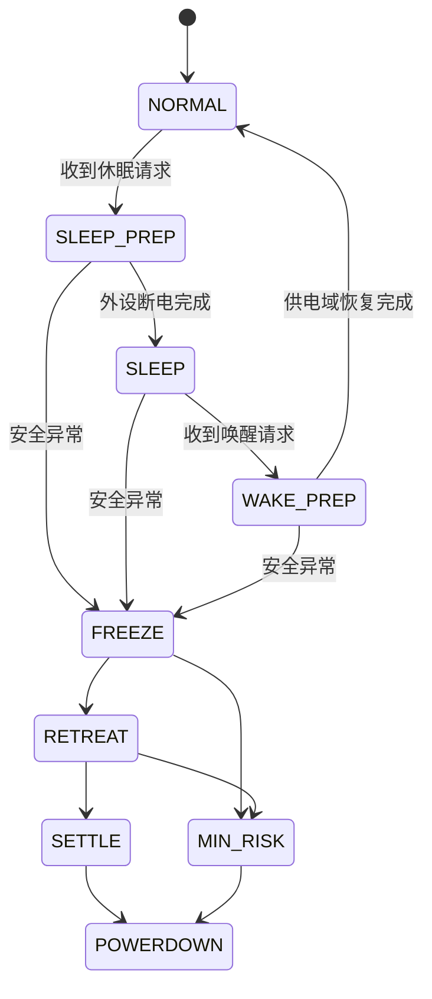

# Safety MCU 模块视图（用于评审基线）

> 目标场景：6 关节独立关节 MCU + SoC + UPS（仅约 20 秒运动窗口）

## 1. 模块总览

## 2. 逻辑分离功能块

| 模块 | 主要职责 | 输入 | 输出 | 安全等级建议 |
|---|---|---|---|---|
| 安全输入采集（IO） | 急停、限位、驱动故障、UPS/供电、SoC 心跳采集与去抖 | 硬件输入、通信状态 | 标准化事件 | 高 |
| 故障判定（FAULT） | 故障分级（告警/降级/安全停机/急停）、超时判定 | IO 事件 | 故障等级、触发原因 | 高 |
| 模式管理（MODE） | 管理状态机（NORMAL→FREEZE→RETREAT→SETTLE→POWERDOWN/ESTOP） | FAULT、执行反馈 | 模式切换命令 | 高 |
| 运动安全协调（COORD） | 向 6 关节 MCU 下发同步动作；轨迹白名单执行；禁区规则检查 | MODE、关节反馈 | 关节阶段目标/限速/超时 | 高 |
| 电源与降载（PWR） | UPS 工况下负载分级切断，保留保臂链路供电 | MODE、UPS 状态 | 电源域控制 | 中高 |
| 安全执行输出（ACT） | 急停链路、继电器、STO/使能切断 | MODE、FAULT | 硬件安全动作 | 最高 |
| 诊断与记录（DIAG） | 故障码、状态迁移、关键时间戳记录 | 全局事件 | 追溯日志 | 中 |
| 自检与看门狗（WD） | 上电自检、周期自检、任务活性监视 | 内部状态 | 复位/进入安全态 | 高 |

## 3. 关键状态机（简版）

## 4. 接口边界（必须固定）

- SoC 仅能发送“请求类命令”，不得覆盖 Safety MCU 的最终裁决。
- 关节 MCU 负责本轴闭环执行；Safety MCU 负责跨轴协调与超时裁决。
- 急停/切使能路径不得依赖 SoC 或普通业务通信。

## 5. 本项目约束下的设计要点

- UPS 仅支持约 20 秒运动：默认应在前 1 秒完成 FREEZE 与降载。
- RETREAT 必须是白名单动作，推荐目标在 12 秒内完成，保留余量到 20 秒。
- 无机械抱闸时，最终安全目标应是“可接受物理支撑状态”，而非长期悬空保持。

## 6. 最小落地清单（MVP）

1. 2~3 条白名单泊车/最小风险轨迹（按工作区分区）。
2. 10~20 条关节组合禁区规则（避免典型自碰撞）。
3. 统一超时策略（心跳超时、轨迹超时、电量阈值超时）。
4. 统一故障码字典与事件日志字段（支持复盘）。

## 7. 协调器与关节 MCU 接口（草案）

> 说明：用于故障态（无 SoC）下的最小可实现协议，目标是保证 20 秒窗口内可执行。

### 7.1 下行命令（Safety MCU -> Joint MCU）

| 字段 | 类型 | 说明 |
|---|---|---|
| `cmd_id` | u16 | 命令序号（单调递增） |
| `mode` | enum | `HOLD` / `RETREAT_A` / `RETREAT_B` / `MIN_RISK` |
| `q_target` | float | 目标关节角（按阶段下发，可为空） |
| `dq_limit` | float | 本阶段速度上限 |
| `tau_limit` | float | 本阶段力矩/电流上限 |
| `t_deadline_ms` | u16 | 本阶段超时时间 |
| `sync_t0_ms` | u32 | 同步启动时间戳 |

### 7.2 上行反馈（Joint MCU -> Safety MCU）

| 字段 | 类型 | 说明 |
|---|---|---|
| `joint_id` | u8 | 关节编号（1~6） |
| `cmd_id_ack` | u16 | 对应命令序号 |
| `q_actual` | float | 当前关节角 |
| `dq_actual` | float | 当前角速度 |
| `tracking_err` | float | 跟踪误差 |
| `fault_bits` | bitmask | 过流/过温/编码器异常/驱动异常 |
| `state` | enum | `IDLE` / `RUNNING` / `DONE` / `FAILED` |

### 7.3 关键时序约束（建议）

- Safety MCU 心跳周期：10 ms；超时判定：100~300 ms。
- 故障触发到 `FREEZE`：<= 100 ms。
- 进入 `RETREAT` 决策窗口：<= 1 s。
- `RETREAT` 目标完成：建议 <= 12 s（为 20 s UPS 窗口保留余量）。
- 任一关节反馈 `FAILED` 或超时：立即切 `MIN_RISK`。

### 7.4 最小安全规则（运行期检查）

1. 单轴硬限位、软限位、速度/电流限幅必须始终生效。
2. 执行白名单动作期间，禁止接受 SoC 新任务命令。
3. 关节组合禁区命中时，协调器应下发减速或回退，不得继续逼近。
4. 超过 `t_deadline_ms` 未完成阶段目标，必须升级到更保守动作（`MIN_RISK` 或断动力）。

## 8. 休眠/唤醒与故障优先级

> 场景：休眠是供电层动作（关外设/关摄像头，保持机械臂），但休眠期间若出现硬件异常，必须切入安全流程。

### 8.1 设计原则

1. **安全优先于省电**：任意时刻出现安全相关异常，立即中断休眠流程，进入 `FREEZE -> DECIDE -> RETREAT -> SETTLE`。
2. **休眠不改变安全裁决权**：SoC 休眠/离线不影响 Safety MCU 的独立判定与动作执行。
3. **休眠不是安全状态**：仅是电源模式；机械臂仍可能需要执行保臂/回撤动作。

### 8.2 电源域策略（建议）

- 休眠可关闭：摄像头、非关键外设、非安全计算负载。
- 休眠必须保留：Safety MCU、关节 MCU、驱动器控制电源、关键通信链路、必要传感输入。
- 唤醒后按白名单顺序恢复供电，防止上电冲击和状态不一致。

### 8.3 状态机扩展（含休眠）

### 8.4 事件优先级（建议）

1. **P0 安全异常事件**（急停、安全回路断开、关键驱动故障、供电危险异常）
   - 立即抢占所有休眠/唤醒流程，切 `FREEZE`。
2. **P1 电源保护事件**（UPS 低电量阈值、供电域异常）
   - 允许中断休眠，进入保臂/回撤流程。
3. **P2 普通电源管理事件**（休眠请求、外设断电、常规唤醒）
   - 仅在无 P0/P1 时执行。

### 8.5 休眠期间异常处理时序（最小实现）

- `t0`: 系统处于 `SLEEP`（外设与摄像头已断电，机械臂保持）。
- `t0+Δ1`: 检测到 P0/P1 事件（例如关键硬件异常）。
- `t0+Δ2`（<=100 ms）: 进入 `FREEZE`，冻结新命令并执行必要降载。
- `t0+Δ3`（<=1 s）: `DECIDE` 完成，选择 `RETREAT` 或 `MIN_RISK`。
- `t0+Δ4`（建议 <=12 s）: 完成 `SETTLE` 或进入 `MIN_RISK` 收敛。

### 8.6 接口补充字段（可选）

在协调器下行命令增加电源模式上下文，避免关节侧误判：

| 字段 | 类型 | 说明 |
|---|---|---|
| `power_mode` | enum | `NORMAL` / `SLEEP_PREP` / `SLEEP` / `WAKE_PREP` |
| `safety_override` | bool | 为 `1` 时强制以安全模式执行，忽略普通休眠命令 |
