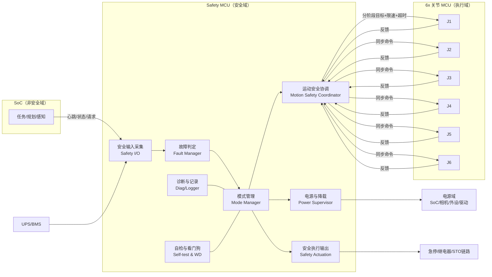
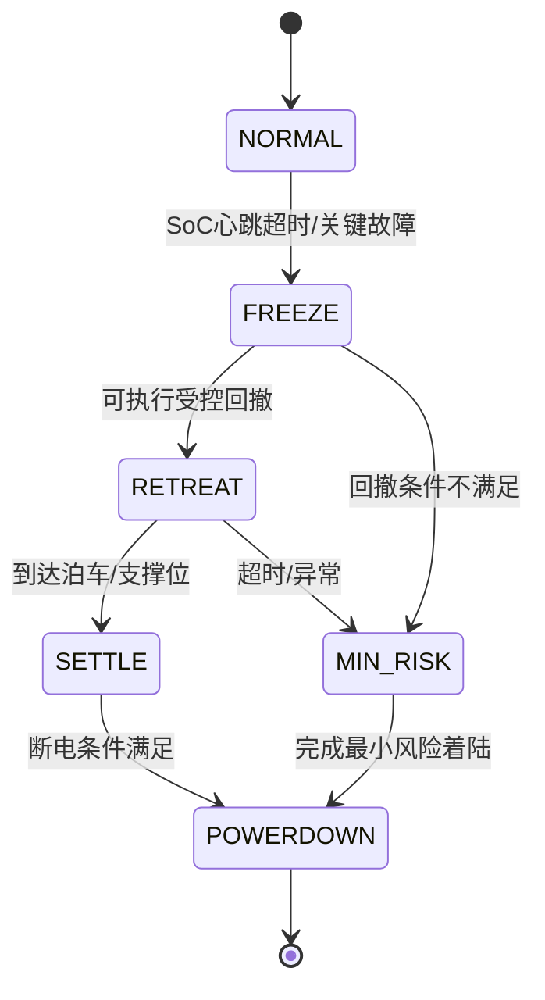

# Safety MCU 模块视图（用于评审基线）

> 目标场景：6 关节独立关节 MCU + SoC + UPS（仅约 20 秒运动窗口）

## 1. 模块总览

## 2. 逻辑分离功能块

| 模块 | 主要职责 | 输入 | 输出 | 安全等级建议 |
|---|---|---|---|---|
| 安全输入采集（IO） | 急停、限位、驱动故障、UPS/供电、SoC 心跳采集与去抖 | 硬件输入、通信状态 | 标准化事件 | 高 |
| 故障判定（FAULT） | 故障分级（告警/降级/安全停机/急停）、超时判定 | IO 事件 | 故障等级、触发原因 | 高 |
| 模式管理（MODE） | 管理状态机（NORMAL→FREEZE→RETREAT→SETTLE→POWERDOWN/ESTOP） | FAULT、执行反馈 | 模式切换命令 | 高 |
| 运动安全协调（COORD） | 向 6 关节 MCU 下发同步动作；轨迹白名单执行；禁区规则检查 | MODE、关节反馈 | 关节阶段目标/限速/超时 | 高 |
| 电源与降载（PWR） | UPS 工况下负载分级切断，保留保臂链路供电 | MODE、UPS 状态 | 电源域控制 | 中高 |
| 安全执行输出（ACT） | 急停链路、继电器、STO/使能切断 | MODE、FAULT | 硬件安全动作 | 最高 |
| 诊断与记录（DIAG） | 故障码、状态迁移、关键时间戳记录 | 全局事件 | 追溯日志 | 中 |
| 自检与看门狗（WD） | 上电自检、周期自检、任务活性监视 | 内部状态 | 复位/进入安全态 | 高 |

## 3. 关键状态机（简版）

## 4. 接口边界（必须固定）

- SoC 仅能发送“请求类命令”，不得覆盖 Safety MCU 的最终裁决。
- 关节 MCU 负责本轴闭环执行；Safety MCU 负责跨轴协调与超时裁决。
- 急停/切使能路径不得依赖 SoC 或普通业务通信。

## 5. 本项目约束下的设计要点

- UPS 仅支持约 20 秒运动：默认应在前 1 秒完成 FREEZE 与降载。
- RETREAT 必须是白名单动作，推荐目标在 12 秒内完成，保留余量到 20 秒。
- 无机械抱闸时，最终安全目标应是“可接受物理支撑状态”，而非长期悬空保持。

## 6. 最小落地清单（MVP）

1. 2~3 条白名单泊车/最小风险轨迹（按工作区分区）。
2. 10~20 条关节组合禁区规则（避免典型自碰撞）。
3. 统一超时策略（心跳超时、轨迹超时、电量阈值超时）。
4. 统一故障码字典与事件日志字段（支持复盘）。
